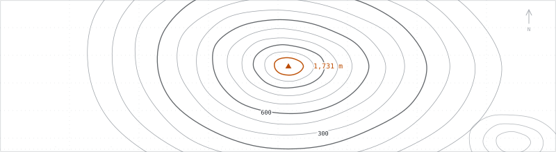

# volcanic

<picture>
  <source media="(prefers-color-scheme: dark)" srcset="assets/hero-contour-dark.svg" />
  <source media="(prefers-color-scheme: light)" srcset="assets/hero-contour-light.svg" />
  
</picture>

Vibe coding first. Building AI-powered trading and dev tools, from crypto radar dashboards to desktop shells for coding agents.

## Stack

**Languages** · TypeScript · JavaScript · Rust · Python · Dart
**Builds with** · React · Next.js · Node.js · Bun · Electron · Flutter
