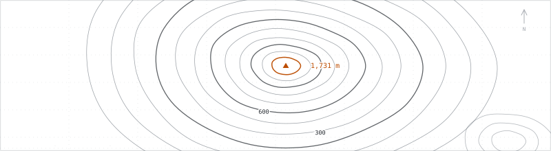
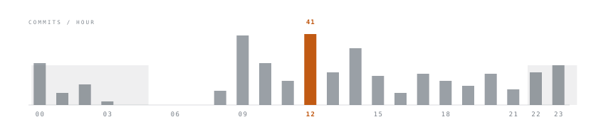

# volcanic

<picture>
  <source media="(prefers-color-scheme: dark)" srcset="assets/hero-contour-dark.svg" />
  <source media="(prefers-color-scheme: light)" srcset="assets/hero-contour-light.svg" />
  
</picture>

Something gets in my way; I would rather build the fix than learn to live with it.
Small tools, written fast, thrown straight into use — until the next thing gets in my way.

<picture>
  <source media="(prefers-color-scheme: dark)" srcset="assets/plate-dark.svg" />
  <source media="(prefers-color-scheme: light)" srcset="assets/plate-light.svg" />
  
</picture>

## When the commits land

<picture>
  <source media="(prefers-color-scheme: dark)" srcset="assets/diurnal-dark.svg" />
  <source media="(prefers-color-scheme: light)" srcset="assets/diurnal-light.svg" />
  
</picture>

<i><!-- survey:readings -->311 commits over the last twelve months, local time — 69 fewer than the last survey and one in nine of them after 22:00.<!-- /survey:readings --> <!-- survey:sleep -->The shaded hours are the night ones. 04:00–07:00 is empty because that is when I sleep,<!-- /survey:sleep --> and the 22:00 spike is "<b>just one more thing</b>", which has never once been one thing.</i>

## In the workshop

Not a portfolio — just what happens to be open on the desk. Each one started as something that got in my way:

**[cabledrop](https://github.com/volcanicll/cabledrop)** — files and clipboard between my Mac and whatever Android phone is on the desk, over a single USB cable. No cloud, no pairing, nothing to install on the phone.

**[glm-usage-monitor](https://github.com/volcanicll/glm-usage-monitor)** — coding-plan quota in the VS Code status bar, so it does not evaporate mid-refactor.

**[obsidian-md-publisher](https://github.com/volcanicll/obsidian-md-publisher)** — Markdown notes to a WeChat draft in one click. Ended a lot of copy-pasting.

**[kitup](https://github.com/volcanicll/kitup)** — one command to update every AI coding CLI on the machine. I had six of them installed and was updating none.

## Lately

Reading about fully homomorphic encryption, poking at Bitcoin's scripting corners, and finding out how far a coding agent can be driven without ever touching its own UI. Most of it does not work. That is the fun part.

*small tools, mostly for me*

<picture>
  <source media="(prefers-color-scheme: dark)" srcset="assets/scalebar-dark.svg" />
  <source media="(prefers-color-scheme: light)" srcset="assets/scalebar-light.svg" />
  
</picture>

